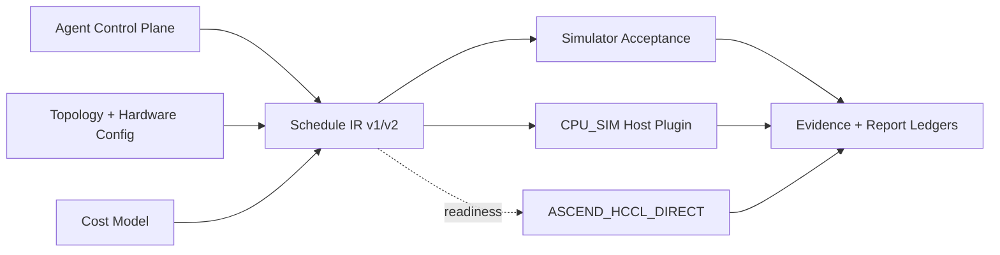

# System Architecture and Algorithm Design

Report Status: `FINAL_EVIDENCE_DERIVED` 
Source Commit: `540d530e2982403376a229e8c7767902820b3199` 
Evidence Snapshot: `G3-B2 99e81dc858e965fd339f2e2e1c711f85238479fb89521c5f8ebaf673f4c05483`; `G3-B3 45b437e76c09a023f908cb8f724849bd93b3bd65fefb3cc4514251eb4af3e754` 
Execution Identity: `HISTORICAL_EVIDENCE + HOST_EXECUTED + SIMULATED_ONLY` 
Real-device Validated: `false` 
Runtime API Executed: `false` 
Applicable Checkpoints: `R01, G3-B2, G3-B3, G3-C`

## Purpose

给出 Final Feature Freeze 后的总体架构、backend registry、三原语、算法族与 Agent decision loop。

## Scope

系统分为 Agent Control Plane、Schedule Layer、Topology Layer、Cost Model、Simulator、CPU_SIM、ASCEND_HCCL_VM、ASCEND_HCCL_DIRECT 与 Submission/Evidence Layer。`SIMULATOR_ACCEPTANCE` 是独立 validation track，不是第四个 backend。

## Validation Identity

- `CPU_SIM`: project-owned host-executed reference plugin；default backend。
- `ASCEND_HCCL_VM`: official `hccl_test` subprocess contract；G3-C 不执行。
- `ASCEND_HCCL_DIRECT`: compile/link/readiness source；G3-C 不执行。
- `fallback=NONE`，不把 host 结果隐式升级为 device 结果。

## Source Evidence

- `agent/`、`algorithm/`、`topology/`、`cost_model/`、`simulator/`
- `experiments/optimization/evidence/g3_b2_f_final_20260807T040000Z/algorithm_support_matrix.json`
- `experiments/feature_completion/evidence/g3_b3_f_final_20260807T170000Z/agent_trace_inventory.json`

## Methodology

三原语为 AllReduce、AllGather、ReduceScatter。AllReduce 对同形输入执行 reduction 并向所有 rank 返回结果；AllGather 保留 rank 顺序与边界；ReduceScatter 先 reduction，再按 owner segment 分发。Broadcast 与 AlltoAll 不在正式支持 primitive 中。

## Results

### Algorithm support matrix

| Algorithm | Primitive | Status |
|---|---|---|
| Butterfly | AllGather | SUPPORTED <!-- metric:g3b2.algorithm.butterfly.allgather --> |
| Butterfly | AllReduce | SUPPORTED <!-- metric:g3b2.algorithm.butterfly.allreduce --> |
| Butterfly | ReduceScatter | UNSUPPORTED_ALGORITHM_PRIMITIVE_PAIR <!-- metric:g3b2.algorithm.butterfly.reducescatter --> |
| Hierarchical | AllGather | UNSUPPORTED_ALGORITHM_PRIMITIVE_PAIR <!-- metric:g3b2.algorithm.hierarchical.allgather --> |
| Hierarchical | AllReduce | SUPPORTED <!-- metric:g3b2.algorithm.hierarchical.allreduce --> |
| Hierarchical | ReduceScatter | UNSUPPORTED_ALGORITHM_PRIMITIVE_PAIR <!-- metric:g3b2.algorithm.hierarchical.reducescatter --> |
| Mesh | AllGather | UNSUPPORTED_ALGORITHM_PRIMITIVE_PAIR <!-- metric:g3b2.algorithm.mesh.allgather --> |
| Mesh | AllReduce | SUPPORTED <!-- metric:g3b2.algorithm.mesh.allreduce --> |
| Mesh | ReduceScatter | SUPPORTED <!-- metric:g3b2.algorithm.mesh.reducescatter --> |
| NHR | AllGather | UNSUPPORTED_ALGORITHM_PRIMITIVE_PAIR <!-- metric:g3b2.algorithm.nhr.allgather --> |
| NHR | AllReduce | SUPPORTED <!-- metric:g3b2.algorithm.nhr.allreduce --> |
| NHR | ReduceScatter | UNSUPPORTED_ALGORITHM_PRIMITIVE_PAIR <!-- metric:g3b2.algorithm.nhr.reducescatter --> |
| Ring | AllGather | SUPPORTED <!-- metric:g3b2.algorithm.ring.allgather --> |
| Ring | AllReduce | SUPPORTED <!-- metric:g3b2.algorithm.ring.allreduce --> |
| Ring | ReduceScatter | SUPPORTED <!-- metric:g3b2.algorithm.ring.reducescatter --> |

PairWise 状态为 `SKIPPED_BY_VALUE_GATE` <!-- metric:g3b3.gates.pairwise -->，因此不进入 implemented matrix。

### Complexity interpretation

| Family | Phase tendency | Latency sensitivity | Bandwidth sensitivity | Topology assumption | Rank/message notes |
|---|---|---|---|---|---|
| Ring | linear in rank count | higher for small messages | efficient streaming | cycle/path | broad rank support |
| Butterfly | logarithmic stages where supported | favorable | exchange-pattern dependent | power-of-two friendly | AllReduce/AllGather only |
| Mesh | low phase count on dense connectivity | favorable | link fan-out sensitive | full/near-full mesh | AllReduce/ReduceScatter |
| NHR | hierarchy-aware rounds | hierarchy dependent | cross-group sensitive | hierarchical groups | AllReduce only |
| Hierarchical/Fat-Tree | intra/inter-group phases | topology dependent | uplink sensitive | explicit groups/tree | AllReduce only |

这些是实现/IR 复杂度特征，不是实机效率测量。

### Agent decision loop

`input → candidate schedules → correctness hard gate → cost evaluation → selection → reflection → replanning`。冻结 trace 包含 proposal 20 <!-- metric:g3b3.agent.proposal_records -->、evaluation 20 <!-- metric:g3b3.agent.evaluation_records -->、reflection 20 <!-- metric:g3b3.agent.reflection_records -->。`development_agent=Codex`、`runtime_agent=hccl-agent`、`human_reviewer=user` 是不同身份。

## Interpretation

架构允许同一 Schedule/Agent 体系消费 dense、sparse、integrity 与 flow-control fields，但每条验证结果保留独立 truth identity。

## Claim Boundaries

- 不把 `SIMULATOR_ACCEPTANCE` 描述为 backend。
- 不把 PairWise 描述为已实现。
- 不把 Agent proposal/replay 描述成无人监督的真实设备调优。

## Known Limitations

本报告只使用冻结的 host、simulator 与 compile/link evidence。没有真实 Ascend NPU、ACL/HCCL runtime、communicator、collective、training 或 profiler 证据。

## Reproduction

运行 `python -m tools.report_cli verify` 核对支持矩阵、claims 与引用。

## Artifact References

- `docs/submission/report_data_ledger.json`
- `docs/submission/report_claim_ledger.json`
