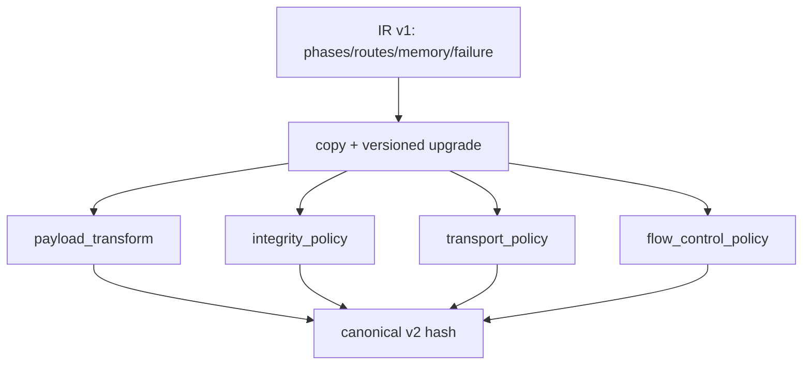

# Collective Schedule IR and Algorithm Evolution

Report Status: `FINAL_EVIDENCE_DERIVED` 
Source Commit: `540d530e2982403376a229e8c7767902820b3199` 
Evidence Snapshot: `G3-B2 99e81dc858e965fd339f2e2e1c711f85238479fb89521c5f8ebaf673f4c05483`; `G3-B3 45b437e76c09a023f908cb8f724849bd93b3bd65fefb3cc4514251eb4af3e754` 
Execution Identity: `CPU_EXECUTED + HISTORICAL_EVIDENCE` 
Real-device Validated: `false` 
Runtime API Executed: `false` 
Applicable Checkpoints: `R02, G3-B2, G3-B3, G3-C`

## Purpose

解释 G3-B2 Schedule IR v1 到 G3-B3 Schedule IR v2 的增量演化与历史兼容边界。

## Scope

IR v1 包含 phases、transfers、chunks、routes、dependencies、memory plan、failure policy 与 canonical schedule hash。IR v2 增加 payload transform、integrity policy、transport/retry policy、flow-control policy，以及 logical/wire accounting。

## Validation Identity

IR 生成与 parity 是 host/CPU evidence；基于 IR 的 latency 与 bandwidth 仍是 `SIMULATED_ONLY`。

## Source Evidence

- `algorithm/schedule_ir.py`、`hcccl/src/schedule_ir.c`
- `feature_completion/contracts.py`、`feature_completion/reliability.py`
- `experiments/optimization/evidence/g3_b2_f_final_20260807T040000Z/c_python_parity_audit.json`
- `experiments/feature_completion/evidence/g3_b3_f_final_20260807T170000Z/schedule_ir_v2_audit.json`

## Methodology

v2 通过复制并扩展 v1，不修改传入的 v1 document；canonical hash 排除 hash field 本身后按稳定 JSON 编码计算。v1 historical evidence remains immutable，v2 不重写 v1 history。

## Results

C/Python parity 覆盖 30 <!-- metric:g3b2.parity.case_count --> 个冻结 case，全部 canonical equal=true <!-- metric:g3b2.parity.all_canonical_equal -->。代表性 schedule hash 为 `f48e7f11656e01357ad57f729a827b7bd569c9e63d437250b09587ff8b46be55 <!-- metric:g3b2.parity.representative_schedule_hash -->`。

代表性 schedule families 包括 Ring AllReduce、Butterfly、NHR、Hierarchical 与 sparse-aware v2 schedule；每个 schedule 必须先通过 invariant validation，再参与 selector/cost evaluation。

## Interpretation

IR v2 是 feature-completion contract，不是新的历史性能实验身份；G3-B2 performance 继续引用 v1 frozen evidence。

## Claim Boundaries

- canonical parity 证明序列化/语义一致性，不证明真实设备执行。
- sparse-aware schedule 的 modeled wire fields 不是物理 NIC counter。

## Known Limitations

本报告只使用冻结的 host、simulator 与 compile/link evidence。没有真实 Ascend NPU、ACL/HCCL runtime、communicator、collective、training 或 profiler 证据。

## Reproduction

运行 `python -m tools.report_cli build` 后再运行 `python -m tools.report_cli verify`。

## Artifact References

- `configs/feature_completion/g3_b3_schedule_ir_v2_schema.json`
- `docs/submission/report_data_ledger.json`
